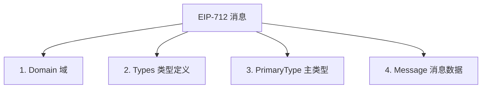
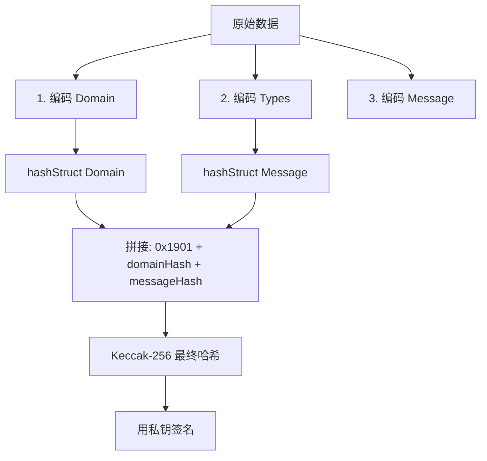

# ERC-712

## EIP-712 详解：结构化数据签名标准

### 📖 什么是 EIP-712？

**EIP-712** (Ethereum Improvement Proposal 712) 是以太坊的一个标准，用于**对结构化数据进行安全的加密签名**。

#### 核心问题

在 EIP-712 之前，如果你要签署一条消息，通常会这样：

```python
# ❌ 旧方式：签署原始文本
message = "Transfer 100 USDT to 0x..."
signature = account.sign_message(message)
```

**问题**：

1. 用户不知道自己在签什么（钓鱼风险）
2. 数据结构不清晰
3. 无法验证消息来源（哪个应用？哪个合约？）
4. 容易被恶意网站欺骗

***

### 🎯 EIP-712 的解决方案

EIP-712 定义了一个**标准格式**，让用户能清楚看到：

* 📝 签署什么类型的数据
* 🏢 数据来自哪个应用/合约
* 📊 数据的详细结构
* 🔒 签名的目标链

#### MetaMask 中的显示对比

```
❌ 旧方式：
Sign this message: 
"0x1234567890abcdef..."
（用户完全看不懂）

✅ EIP-712 方式：
Sign typed data from OpenSea
Domain: OpenSea (opensea.io)
Chain: Ethereum Mainnet

Order Details:
  - Item: Bored Ape #1234
  - Price: 10 ETH
  - Buyer: 0x742d35Cc...
  - Expiry: 2024-01-15 12:00:00

（用户一目了然！）
```

***

### 🏗️ EIP-712 结构

EIP-712 消息包含 **4 个核心部分**：




#### 1️⃣ Domain（域）

定义**签名的上下文**，防止跨域重放攻击。

```python
domain = {
    "name": "MyDApp",                    # 应用名称
    "version": "1",                      # 版本
    "chainId": 1,                        # 链 ID (1=以太坊主网)
    "verifyingContract": "0x1234...",   # 验证合约地址
    "salt": "0xabcd..."                 # 可选：额外的随机盐
}
```

**作用**：

* 确保签名只在特定应用中有效
* 防止在不同链上重放
* 绑定到特定合约

#### 2️⃣ Types（类型定义）

定义**数据结构的 schema**。

```python
types = {
    "EIP712Domain": [
        {"name": "name", "type": "string"},
        {"name": "version", "type": "string"},
        {"name": "chainId", "type": "uint256"},
        {"name": "verifyingContract", "type": "address"}
    ],
    "Person": [
        {"name": "name", "type": "string"},
        {"name": "wallet", "type": "address"}
    ],
    "Mail": [
        {"name": "from", "type": "Person"},
        {"name": "to", "type": "Person"},
        {"name": "contents", "type": "string"}
    ]
}
```

**支持的类型**：

* 基础类型：`address`, `bool`, `uint256`, `int256`, `bytes`, `string`
* 定长数组：`uint256[3]`, `address[5]`
* 动态数组：`uint256[]`, `address[]`
* 自定义结构：嵌套的类型定义

#### 3️⃣ PrimaryType（主类型）

指定**要签名的主要数据类型**。

```python
primaryType = "Mail"  # 表示要签名的是 Mail 类型
```

#### 4️⃣ Message（消息数据）

**实际要签名的数据**，必须符合类型定义。

```python
message = {
    "from": {
        "name": "Alice",
        "wallet": "0x1234..."
    },
    "to": {
        "name": "Bob",
        "wallet": "0x5678..."
    },
    "contents": "Hello Bob!"
}
```

***

### 🔐 完整签名示例

#### Python 实现

```python
from eth_account import Account
from eth_account.messages import encode_structured_data
import json

# 1. 定义 Domain
domain = {
    "name": "MyDApp",
    "version": "1",
    "chainId": 1,
    "verifyingContract": "0xCcCCccccCCCCcCCCCCCcCcCccCcCCCcCcccccccC"
}

# 2. 定义 Types
types = {
    "Person": [
        {"name": "name", "type": "string"},
        {"name": "wallet", "type": "address"}
    ],
    "Mail": [
        {"name": "from", "type": "Person"},
        {"name": "to", "type": "Person"},
        {"name": "contents", "type": "string"}
    ]
}

# 3. 定义 Message
message = {
    "from": {
        "name": "Alice",
        "wallet": "0xCD2a3d9F938E13CD947Ec05AbC7FE734Df8DD826"
    },
    "to": {
        "name": "Bob",
        "wallet": "0xbBbBBBBbbBBBbbbBbbBbbbbBBbBbbbbBbBbbBBbB"
    },
    "contents": "Hello, Bob!"
}

# 4. 构造完整的 EIP-712 数据
structured_data = {
    "types": types,
    "primaryType": "Mail",
    "domain": domain,
    "message": message
}

# 5. 编码数据
encoded_data = encode_structured_data(structured_data)

# 6. 使用私钥签名
private_key = "0x..."
account = Account.from_key(private_key)
signed_message = account.sign_message(encoded_data)

# 7. 获取签名
print(f"签名: {signed_message.signature.hex()}")
print(f"r: {hex(signed_message.r)}")
print(f"s: {hex(signed_message.s)}")
print(f"v: {signed_message.v}")
```

#### JavaScript/TypeScript 实现

```typescript
import { ethers } from 'ethers';

// 1. 定义 Domain
const domain = {
  name: 'MyDApp',
  version: '1',
  chainId: 1,
  verifyingContract: '0xCcCCccccCCCCcCCCCCCcCcCccCcCCCcCcccccccC'
};

// 2. 定义 Types
const types = {
  Person: [
    { name: 'name', type: 'string' },
    { name: 'wallet', type: 'address' }
  ],
  Mail: [
    { name: 'from', type: 'Person' },
    { name: 'to', type: 'Person' },
    { name: 'contents', type: 'string' }
  ]
};

// 3. 定义 Message
const message = {
  from: {
    name: 'Alice',
    wallet: '0xCD2a3d9F938E13CD947Ec05AbC7FE734Df8DD826'
  },
  to: {
    name: 'Bob',
    wallet: '0xbBbBBBBbbBBBbbbBbbBbbbbBBbBbbbbBbBbbBBbB'
  },
  contents: 'Hello, Bob!'
};

// 4. 使用钱包签名
const signer = new ethers.Wallet(privateKey);
const signature = await signer.signTypedData(domain, types, message);

console.log('签名:', signature);

// 5. 分解签名
const sig = ethers.Signature.from(signature);
console.log('r:', sig.r);
console.log('s:', sig.s);
console.log('v:', sig.v);
```

***

### 🔍 EIP-712 编码原理

#### 哈希计算流程



#### 详细编码步骤

**1️⃣ 类型哈希（Type Hash）**

```python
# 对于 Mail 类型：
typeHash = keccak256(
    "Mail(Person from,Person to,string contents)"
    "Person(string name,address wallet)"
)
```

**规则**：

* 按字母顺序排列依赖的类型
* 递归展开所有自定义类型
* 计算整个字符串的 Keccak-256 哈希

**2️⃣ 结构体哈希（Struct Hash）**

```python
# hashStruct(message) 的计算：
hashStruct(message) = keccak256(
    typeHash +
    keccak256(encode(message.from)) +
    keccak256(encode(message.to)) +
    keccak256(message.contents)
)
```

**编码规则**：

* `address`, `uint256` 等基础类型：直接编码（32字节）
* `string`, `bytes`：先计算 Keccak-256 哈希
* 自定义类型：递归调用 `hashStruct`

**3️⃣ 最终签名哈希**

```python
# EIP-712 最终哈希
finalHash = keccak256(
    "0x1901" +                    # EIP-191 前缀
    hashStruct(domain) +          # Domain 哈希
    hashStruct(message)           # Message 哈希
)

# 签名
signature = sign(finalHash, privateKey)
```

***

### 🛡️ 验证签名

#### 链上验证（Solidity）

```solidity
// SPDX-License-Identifier: MIT
pragma solidity ^0.8.0;

contract EIP712Verifier {
    // Domain Separator
    bytes32 private immutable DOMAIN_SEPARATOR;
    
    // Type hashes
    bytes32 private constant MAIL_TYPEHASH = keccak256(
        "Mail(Person from,Person to,string contents)"
        "Person(string name,address wallet)"
    );
    
    bytes32 private constant PERSON_TYPEHASH = keccak256(
        "Person(string name,address wallet)"
    );
    
    struct Person {
        string name;
        address wallet;
    }
    
    struct Mail {
        Person from;
        Person to;
        string contents;
    }
    
    constructor() {
        DOMAIN_SEPARATOR = keccak256(
            abi.encode(
                keccak256(
                    "EIP712Domain(string name,string version,uint256 chainId,address verifyingContract)"
                ),
                keccak256(bytes("MyDApp")),
                keccak256(bytes("1")),
                block.chainid,
                address(this)
            )
        );
    }
    
    function hashPerson(Person memory person) private pure returns (bytes32) {
        return keccak256(
            abi.encode(
                PERSON_TYPEHASH,
                keccak256(bytes(person.name)),
                person.wallet
            )
        );
    }
    
    function hashMail(Mail memory mail) private pure returns (bytes32) {
        return keccak256(
            abi.encode(
                MAIL_TYPEHASH,
                hashPerson(mail.from),
                hashPerson(mail.to),
                keccak256(bytes(mail.contents))
            )
        );
    }
    
    function verify(
        Mail memory mail,
        uint8 v,
        bytes32 r,
        bytes32 s
    ) public view returns (address) {
        bytes32 digest = keccak256(
            abi.encodePacked(
                "\x19\x01",
                DOMAIN_SEPARATOR,
                hashMail(mail)
            )
        );
        
        return ecrecover(digest, v, r, s);
    }
}
```

#### 链下验证（Python）

```python
from eth_account import Account
from eth_account.messages import encode_structured_data

def verify_signature(structured_data, signature, expected_signer):
    """验证 EIP-712 签名"""
    
    # 1. 编码数据
    encoded = encode_structured_data(structured_data)
    
    # 2. 恢复签名者地址
    recovered_address = Account.recover_message(
        encoded,
        signature=signature
    )
    
    # 3. 验证签名者
    return recovered_address.lower() == expected_signer.lower()

# 使用示例
is_valid = verify_signature(
    structured_data=my_eip712_data,
    signature="0x123...",
    expected_signer="0xABC..."
)

print(f"签名有效: {is_valid}")
```

***

### 🎯 实际应用场景

#### 1. DEX 订单签名（如 Hyperliquid）

```python
# Hyperliquid 的 EIP-712 订单签名
domain = {
    "name": "Exchange",
    "version": "1",
    "chainId": 42161,  # Arbitrum
    "verifyingContract": "0x0000000000000000000000000000000000000000"
}

types = {
    "Agent": [
        {"name": "source", "type": "string"},
        {"name": "connectionId", "type": "bytes32"}
    ]
}

message = {
    "source": "a",  # API
    "connectionId": keccak256(action + nonce)
}

# 签名后发送到交易所
```

#### 2. NFT 市场订单（如 OpenSea）

```typescript
const domain = {
  name: 'OpenSea',
  version: '1',
  chainId: 1,
  verifyingContract: '0x...'
};

const types = {
  Order: [
    { name: 'maker', type: 'address' },
    { name: 'taker', type: 'address' },
    { name: 'nftContract', type: 'address' },
    { name: 'tokenId', type: 'uint256' },
    { name: 'price', type: 'uint256' },
    { name: 'expiry', type: 'uint256' }
  ]
};

const order = {
  maker: '0x...',
  taker: '0x0000000000000000000000000000000000000000',
  nftContract: '0x...',
  tokenId: 1234,
  price: ethers.parseEther('10'),
  expiry: Math.floor(Date.now() / 1000) + 86400
};

const signature = await signer.signTypedData(domain, types, order);
```

#### 3. DAO 投票签名

```python
domain = {
    "name": "MyDAO",
    "version": "1",
    "chainId": 1,
    "verifyingContract": "0x..."
}

types = {
    "Vote": [
        {"name": "proposalId", "type": "uint256"},
        {"name": "support", "type": "bool"},
        {"name": "voter", "type": "address"},
        {"name": "nonce", "type": "uint256"}
    ]
}

message = {
    "proposalId": 42,
    "support": True,  # 赞成
    "voter": "0x...",
    "nonce": 1
}
```

#### 4. 元交易（Meta Transaction）

```solidity
// 用户签名，中继者代付 Gas
struct MetaTx {
    address from;
    address to;
    uint256 value;
    uint256 gas;
    uint256 nonce;
    bytes data;
}

// 用户签名 MetaTx
// 中继者提交到链上，验证签名后执行
```

***

### 🔒 安全性考虑

#### 1. Domain Separator 的重要性

```python
# ❌ 危险：不同应用使用相同 domain
domain1 = {"name": "App", "version": "1", "chainId": 1}
domain2 = {"name": "App", "version": "1", "chainId": 1}
# 签名可能被重放到另一个应用！

# ✅ 安全：绑定到特定合约
domain = {
    "name": "MyApp",
    "version": "1",
    "chainId": 1,
    "verifyingContract": "0x1234..."  # 唯一合约地址
}
```

#### 2. 防止重放攻击

```python
# ✅ 添加 nonce
message = {
    "action": "transfer",
    "amount": 100,
    "nonce": 12345  # 每次递增
}

# ✅ 添加过期时间
message = {
    "action": "transfer",
    "amount": 100,
    "expiry": 1704067200  # Unix 时间戳
}

# ✅ 添加链 ID
domain = {
    "chainId": 1  # 确保只在以太坊主网有效
}
```

#### 3. 用户体验优化

```python
# ✅ 清晰的字段命名
types = {
    "Order": [
        {"name": "buyer", "type": "address"},        # ✅ 清晰
        {"name": "priceInEth", "type": "uint256"},  # ✅ 带单位
        {"name": "expiryDate", "type": "uint256"}   # ✅ 说明含义
    ]
}

# ❌ 糟糕的命名
types = {
    "Order": [
        {"name": "a", "type": "address"},      # ❌ 不知道是什么
        {"name": "p", "type": "uint256"},      # ❌ 不知道单位
        {"name": "t", "type": "uint256"}       # ❌ 不知道含义
    ]
}
```

***

### 📊 EIP-712 vs 其他签名方式

| 特性       | 原始签名 | EIP-191 | EIP-712 |
| -------- | ---- | ------- | ------- |
| **可读性**  | ❌ 差  | ⚠️ 一般   | ✅ 优秀    |
| **结构化**  | ❌ 无  | ⚠️ 部分   | ✅ 完整    |
| **类型安全** | ❌ 无  | ❌ 无     | ✅ 有     |
| **防重放**  | ❌ 弱  | ⚠️ 中等   | ✅ 强     |
| **钱包支持** | ✅ 全部 | ✅ 全部    | ✅ 主流钱包  |
| **用户体验** | ❌ 差  | ⚠️ 一般   | ✅ 优秀    |

#### 示例对比

```python
# 1. 原始签名（不推荐）
signature = account.sign_message("Transfer 100 USDT")
# 用户看到：一串十六进制，完全不知道在签什么

# 2. EIP-191（个人签名）
message = encode_defunct(text="Transfer 100 USDT to 0x...")
signature = account.sign_message(message)
# 用户看到：纯文本，但没有结构

# 3. EIP-712（推荐）✅
structured_data = {
    "domain": {...},
    "types": {...},
    "message": {
        "action": "Transfer",
        "amount": "100 USDT",
        "to": "0x...",
        "deadline": "2024-01-15 12:00"
    }
}
# 用户看到：清晰的结构化数据，一目了然
```

***

### 🛠️ 调试工具

#### 1. 本地调试

```python
from eth_account.messages import encode_structured_data
import json

# 打印编码后的数据
structured_data = {...}
encoded = encode_structured_data(structured_data)

print("Domain Separator:", encoded.header.hex())
print("Message Hash:", encoded.body.hex())
print("Final Hash:", encoded.signable_message.hex())
```

#### 2. Solidity 调试

```solidity
// 在合约中打印中间值
function debugEIP712(Mail memory mail) public view returns (
    bytes32 domainSeparator,
    bytes32 mailHash,
    bytes32 finalDigest
) {
    domainSeparator = DOMAIN_SEPARATOR;
    mailHash = hashMail(mail);
    finalDigest = keccak256(
        abi.encodePacked("\x19\x01", domainSeparator, mailHash)
    );
}
```

***

### 💡 最佳实践总结

#### ✅ 推荐做法

1.  **使用标准化的 Domain**

    ```python
    domain = {
        "name": "清晰的应用名",
        "version": "1",
        "chainId": chain_id,
        "verifyingContract": contract_address
    }
    ```
2. **清晰的类型命名**
   * 使用完整的字段名
   * 添加单位说明（如 `amountInWei`）
   * 使用语义化的类型名
3. **添加安全字段**
   * `nonce`: 防止重放
   * `deadline/expiry`: 设置过期时间
   * `chainId`: 绑定到特定链
4. **验证签名**
   * 总是在合约中验证签名
   * 检查签名者权限
   * 验证 nonce 和过期时间

#### ❌ 避免的错误

1. ❌ 不设置 `verifyingContract`
2. ❌ 使用模糊的字段名（如 `a`, `b`, `c`）
3. ❌ 忘记添加 nonce
4. ❌ 不同应用使用相同的 domain
5. ❌ 不验证签名的有效性

***

### 🎓 总结

**EIP-712 的核心价值**：

1. 🔒 **安全性**：防止钓鱼和重放攻击
2. 👁️ **可见性**：用户清楚看到签名内容
3. 🏗️ **结构化**：标准化的数据格式
4. ✅ **可验证**：链上链下都能验证

**应用场景**：

* ✅ DEX 订单签名
* ✅ NFT 交易授权
* ✅ DAO 治理投票
* ✅ 元交易授权
* ✅ 许可证签发

**关键要点**：

* 使用唯一的 Domain Separator
* 清晰的类型定义
* 添加 nonce 和过期时间
* 始终验证签名

EIP-712 是现代 Web3 应用的**标准签名方式**，掌握它对于构建安全的去中心化应用至关重要！🚀
