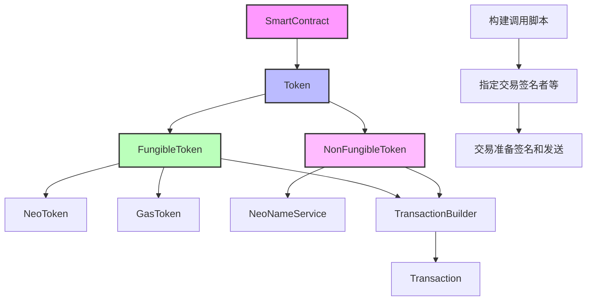

# 代币合约

Neo上有两个代币标准：一个用于同质化代币，一个用于非同质化代币。neow3j SDK通过`FungibleToken`和`NonFungibleToken`类涵盖了与此类代币合约的交互。

下图说明了与代币合约相关的类的结构。它们是`SmartContract`基类的子类型，并提供特定的代币合约方法。在`Token`子类型中，收集了代币合约中使用的常用方法，如`getDecimals()`、`getSymbol()`或`getTotalSupply()`。`FungibleToken`子类型实现了NEP-17标准。NEP-17合约的两个具体实例是原生合约`NeoToken`和`GasToken`，它们包含特定于它们的额外方法，如`registerValidator`、`getRegisteredValidators`或`vote`。`NonFungibleToken`表示符合NEP-11非同质化代币标准的代币合约的包装器。`NeoNameService`合约是此类合约的一个具体示例。



所有这些类都提供了构建脚本和交易以进行合约调用的方法。更改状态的方法返回一个`TransactionBuilder`，可用于进一步配置交易，如指定签名者或额外的网络费用。然后可以签名和构建交易，并将结果`Transaction`发送到Neo节点。

### [同质化代币合约 (NEP-17)](https://neow3j.io/#/neo-n3/dapp_development/token_contracts?id=fungible-token-contracts-nep-17)

[NEP-17](https://github.com/neo-project/proposals/blob/master/nep-17.mediawiki)代币合约上最突出的方法是`transfer`方法。此方法有几个重载。在其基本形式中，`transfer`以`Account`作为发送者。该账户作为签名者添加到交易构建器中，具有`calledByEntry`的见证范围。如果账户包含私钥，您可以使用`sign()`自动签名结果交易。

```java
Account account = Account.fromWIF("L3kCZj6QbFPwbsVhxnB8nUERDy4mhCSrWJew4u5Qh5QmGMfnCTda");
Hash160 to = Hash160.fromAddress("NWcx4EfYdfqn5jNjDz8AHE6hWtWdUGDdmy");

NeoSendRawTransaction response = new NeoToken(neow3j)
        .transfer(account, to, new BigInteger("15"))
        .sign()
        .send();Copy to clipboardErrorCopied
```

另一个`transfer`方法允许您传递`Hash160`而不是`Account`作为发送者。在此版本中，没有附加签名者，由您来添加正确的签名者。当发送者是合约时，这很有用，如下面的示例所示。

```java
Hash160 contractHash = new Hash160("0xacce6fd80d44e1796aa0c2c625e9e4e0ce39efc0");
Hash160 to = Hash160.fromAddress("NWcx4EfYdfqn5jNjDz8AHE6hWtWdUGDdmy");
// 合约的所有者。验证从合约中提取所需。
Account account = Account.fromWIF("L3kCZj6QbFPwbsVhxnB8nUERDy4mhCSrWJew4u5Qh5QmGMfnCTda");

NeoSendRawTransaction response = new NeoToken(neow3j)
        .transfer(contractHash, to, new BigInteger("15"))
        .signers(AccountSigner.calledByEntry(account),
                ContractSigner.calledByEntry(contractHash))
        .sign()
        .send();Copy to clipboardErrorCopied
```

在`transfer`方法的两种变体中，都有另一个重载，允许您传递合约参数。如果接收者是智能合约并已实现该方法，则该参数会转发到`onNep17Payment`方法。如果您要传递多个参数，需要在`ContractParameter.array(...)`内部进行。

### [非同质化代币合约 (NEP-11)](https://neow3j.io/#/neo-n3/dapp_development/token_contracts?id=non-fungible-token-contracts-nep-11)

包装器类`NonFungibleToken`提供对[NEP-11](https://github.com/neo-project/proposals/blob/master/nep-11.mediawiki)标准的支持。有关Neo区块链上非同质化代币的详细信息，请参阅该标准。

重要的是要理解该标准支持不可分割和可分割的非同质化代币。对于可分割代币，一个代币可以有多个所有者，其中每个所有者拥有该代币的一部分。提供的包装器类支持可分割和不可分割代币，而仅适用于可分割代币的方法不能用于不可分割代币，反之亦然。

可分割和不可分割代币合约都实现了`balanceOf(owner)`方法，该方法简单返回给定地址拥有的代币数量。对于可分割代币，这包括代币的分数数量。要获取特定代币拥有的分数数量，您可以使用由可分割代币特定实现的`balanceOf(owner, tokenId)`方法。

此外，NFT提供了`tokens`、`tokensOf`和`ownerOf`等方法。`ownerOf`方法返回不可分割代币的单一所有者。对于可分割代币，此方法返回一个迭代器，其中包含拥有此代币份额的所有所有者。

`transfer`方法有多个重载，一些用于不可分割代币，一些用于可分割代币。对于可分割代币，该方法有一个额外的参数，用于要转移的分数代币数量。类似于`FungibleToken`类上的重载（参见前一节），`NonFungibleToken`也为发送者地址提供了进一步的重载（`Account`或`Hash160`），并用于添加合约参数，如果接收者是智能合约，则该参数会传递给`onNep11Payment`方法。

以下是发送ID为1的代币的200个分数的示例。分数数量必须与代币可以具有的小数位数一致。您可以通过`getDecimals()`方法获取小数位数，或通过`toFractions(...)`方法计算数量。

```java
Account account = Account.fromWIF("L3kCZj6QbFPwbsVhxnB8nUERDy4mhCSrWJew4u5Qh5QmGMfnCTda");
Hash160 to = Hash160.fromAddress("NWcx4EfYdfqn5jNjDz8AHE6hWtWdUGDdmy");

NonFungibleToken nft = new NonFungibleToken(new Hash160("ebc856327332bcffb7587a28ef8d144df6be8537"), neow3j);
TransactionBuilder builder = nft.transfer(account, to, new BigInteger("200"), new byte[]{1});Copy to clipboardErrorCopied
```

NEP-11标准包括一个可选的`properties`方法，该方法返回代币的属性。您可以按如下所示检索代币的属性。

```java
NFTokenState properties = nft.properties(new byte[]{1});
String name = properties.getName();
String description = properties.getDescription();
String image = properties.getImage();
String tokenURI = properties.getTokenURI();
```
